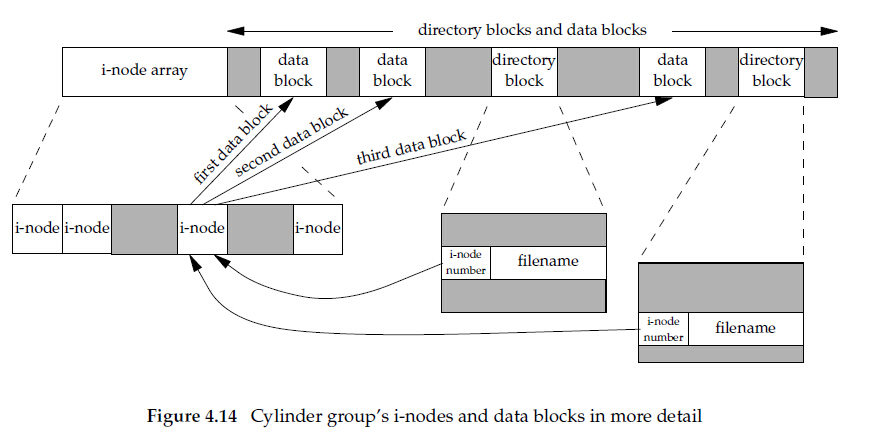
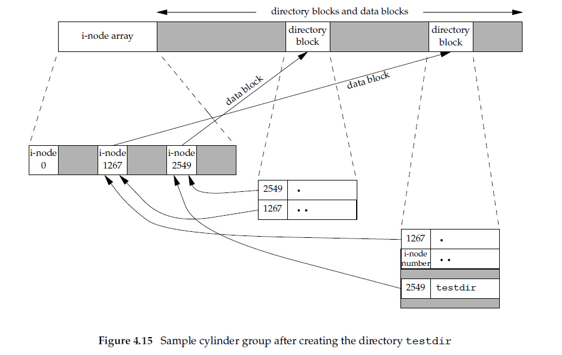

文件和目录
==========

函数stat,fstat,fstatat,lstat
----------------------------

> `#include<sys/stat.h>`
> 
> `int stat(const char *restrict pathname , struct stat *restrict buf);`
> 
> `int fstat(int fd  , struct stat *buf);`
> 
> `int lstat(const char *restrict pathname , struct stat *restrict buf);`
> 
> `int fstatat(int fd,const char *restrict pathname , struct stat *restrict buf ,int flag);`
>
上述函数return 0 or -1    
lstat可以检测符号链接，而stat不会

文件类型
--------

1. 普通文件(regular file)        
2. 目录文件(directory file)        
3. 块特殊文件(block special file)          
4. 字符特殊文件(character special file)        
5. FIFO 用于进程间通信    
6. 套接字(socket)      
7. 符号链接(symbolic link)

设置用户ID和设置组ID
--------------------

于一个进程有关的ID有6个或者更多：

> 实际用户ID 和 实际组ID ： 标识我们究竟是谁
> 
> 有效用户ID 有效组ID 附属组ID ： 用于文件访问权限检查
> 
> 保存的设置用户ID 保存的设置组ID ： 由exec函数保存

通常有效用户ID等于实际用户ID ， 有效组ID等于实际组ID   

文件访问权限
------------

* 我们用名字打开任一类型的文件时，对该名字包含的每一个目录，包括它可能隐含的当前工作目录都应具有执行权限    
* 对于一个文件的读写权限决定了我们是否能够打开现有文件进行读写操作   
* 为了在一个目录中创建一个新文件，必须对该目录具有写权限和执行权限   
* 为了删除一个文件，必须对包含该文件的目录具有写权限和执行权限，对该文件则不需要读写权限     
* 如果用exec函数执行某个文件，必须对该文件有执行权限，而且该文件必须是普通文件    

进程每次打开、创建或删除一个文件时，内核就对文件访问权限测试，具体如下：    
1. 若进程的有效ID是0，则允许访问    
2. 若进程的有效ID==文件的所有者ID，那么如果所有者适当的访问权限被设置，则允许访问       
3. 若进程的有效ID或者进程的附属组ID==文件的组ID，那么如果组适当的访问权限被设置，则允许访问     
4. 若其他用户适当的访问权限位被设置，则允许访问。否则拒绝访问        

但是access函数则是检查实际用户ID，将上述**有效**改为**实际**      


文件系统
--------

我们可以把一个磁盘分成一个或多个分区，每个分区可以包含一个文件系统，i节点是固定长度的记录项，它包含有关文件的大部分信息:          



上图中有两个目录项指向同一个i节点，每个i节点都有一个链接计数，值为指向该i节点的目录项数，只有当链接计数减少为0时，才可以删除该文件，这就是为什么“解除对一个文件的链接”操作并不总是意味着“释放该文件占用的磁盘块”的原因。这种链接类型被称为硬链接。   

     
可以看出，任一叶子目录的链接计数总为2

函数link、linkat、unlink、unlinkat、remove
------------------------------------------

如上节所示，任何一个文件可以有多个目录项指向其i节点   
```C
#include<unistd.h>
int link(const char *existpath,const char *newpath);
int linkat(int efd,const char *existpath,int nfd,const char *newpath,int flag);
//return 0 or -1
```
为了删除一个现有的目录项，可用调用unlink函数。   
```C
#include<unistd.h>
int unlink(const char *pathname);
int unlinkat(int fd,const char *pathname,int flag);
```
前面已经提及，为了解除对文件的链接，必须对包含该目录项的目录具有写和执行的权限。   


