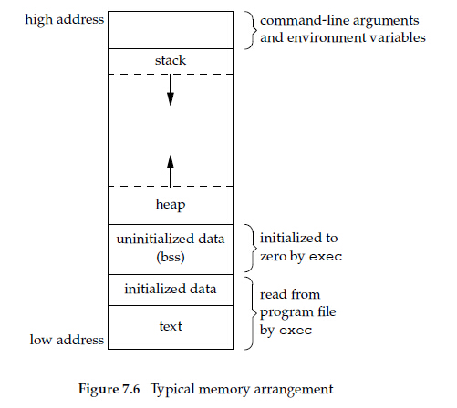

进程环境
========

进程终止
--------
正常终止：   
1. 从main返回    
2. 调用exit   
3. 调用`_exit or _Exit`   
4. 最后一个线程从其启动例程返回   
5. 从最后一个线程调用pthread_exit   

异常终止：   
1. 调用abort   
2. 接到一个信号    
3. 最后一个线程对取消请求做出相应    

**_exit和_Exit立即进入内核，exit则先执行一些清理处理(对所有打开流调用fclose函数)，然后返回内核**   

C程序一直由下列几部分组成
-------------------------
* 正文段   
	即text段，通常正文段是共享的，并且是只读的    
* 初始化数据段    
	即data段，包含类程序中需明确地赋初值的变量，例如，C程序中任何函数之外的声明    
* 未初始化数据段    
	即bss段，在程序开始执行之前，内核将此段中的数据初始化为0或空指针。    
* 栈    
	自动变量以及每次函数调用时所需保存的信息都放在此段中。    
* 堆    
	通常在堆中进行动态存储分配     

下图显示了这些段的一种典型安排方式：     

